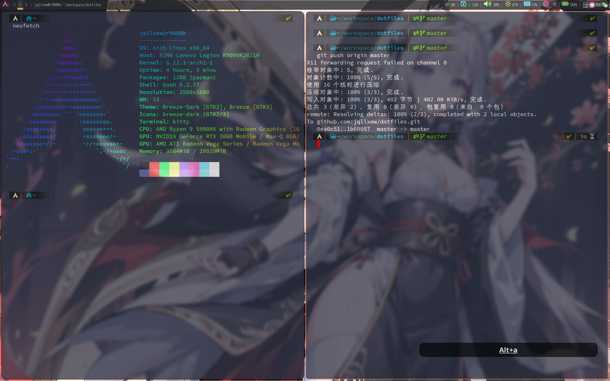

## env
```bash
pacman -S polybar betterlockscreen fcitx5 kitty zsh i3-wm picom
# font
pacman -S ttf-hack-nerd
# 屏幕按键反馈
pacman -S screenkey
# 窗口属性
pacman -S xorg-xprop
```

## oh-my-zsh
```bash
sh -c "$(curl -fsSL https://raw.githubusercontent.com/ohmyzsh/ohmyzsh/master/tools/install.sh)"
cd ~/.oh-my-zsh/custom/themes/
git clone git@github.com:romkatv/powerlevel10k.git
# 删除 ~/.p10k.zsh 可重新安装
```

